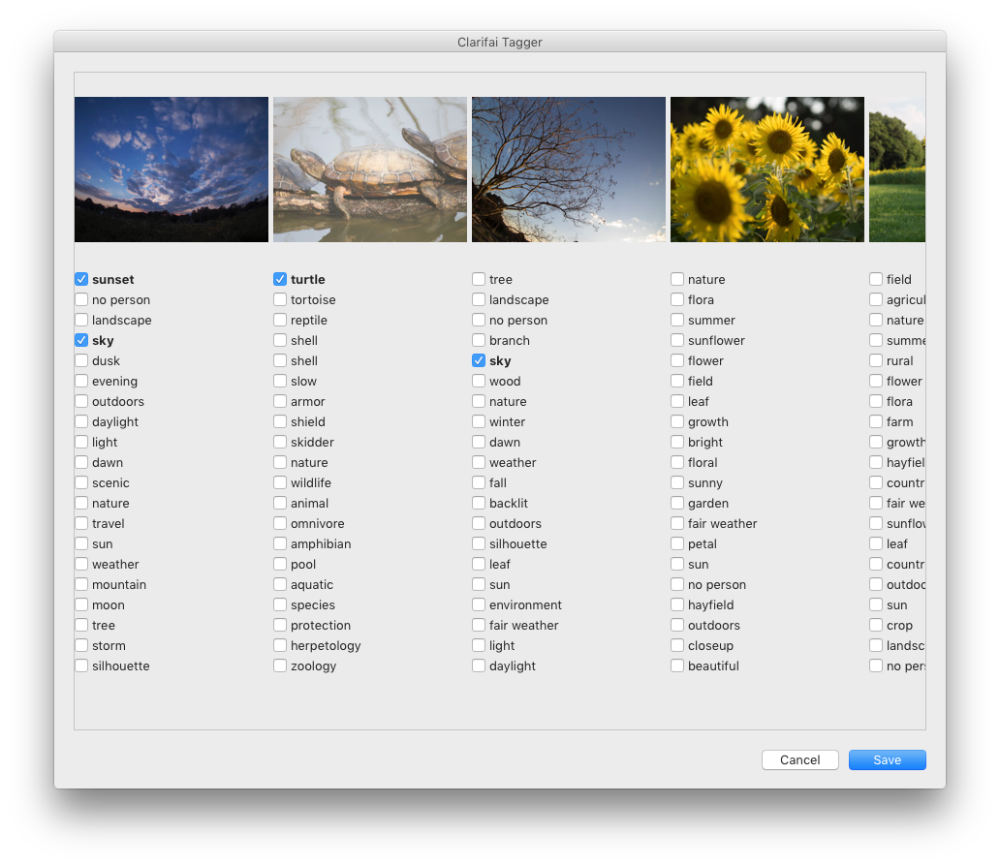
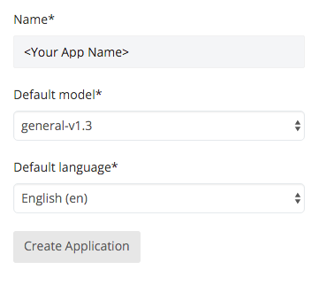
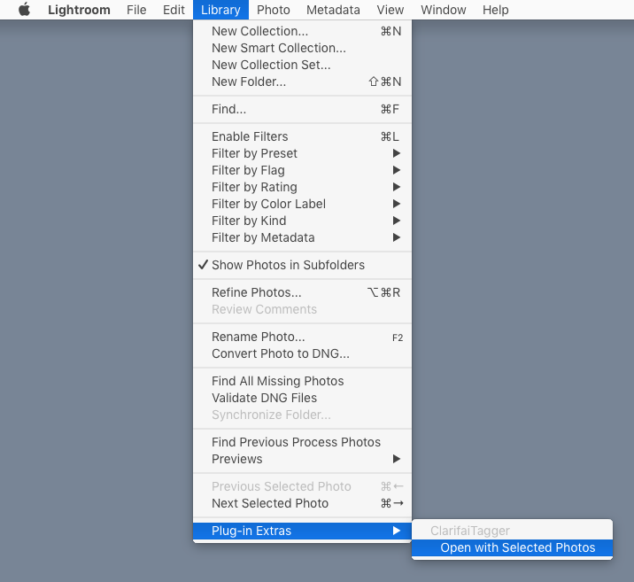
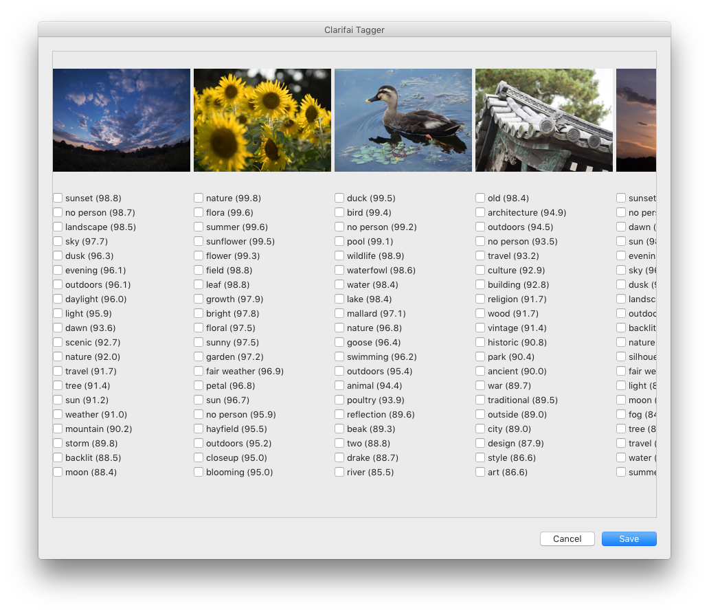

# LightroomPlugin-ClarifaiTagger

A Lightroom plugin helps you to add keywords of photos, powered by [Clarifai](http://www.clarifai.com/), visual recognition service.

* works with Jpeg and Raw
* works on Windows and Mac OS X (not tested on Windows yet)

## Create Developer Account

To use ClarifaiTagger, you have to create a developer account of [Clarifai](http://www.clarifai.com/) and create an application.

1. Go [Clarifai](http://www.clarifai.com/) and create a developer accout.

1. Click "Create an application" from Applications → Create a new Application.

    

1. Once you create your application, the Client ID and Client Secret are available.

    

## Install & Setup

To install ClarifaiTagger, follow these steps:

1. Clone or download this project.

1. Open "Lightroom Plug-in Manager" from Lightroom menu → File → Plug-in Manager...

1. Click "Add" and choose `ClarifaiTagger.lrdevplugin`.

    

    Or, just put `ClarifaiTagger.lrdevplugin` to standard location as follows:

    * Mac OS X (current user): `~/Library/Application Support/Adobe/Lightroom/Modules`
    * Mac OS X (all users): `/Library/Application Support/Adobe/Lightroom/Modules`
    * Windows: `C:\Users\username\AppData\Roaming\Adobe\Lightroom\Modules`

1. Fill "Client ID" and "Client Secret" by using "Client ID" and "Client Secret" of the application you've created, respectively.

    

## How to use

1. Select your photos you want to add keywords. You should select up to 128 photos due to limitation of Clarifai.
1. Choose "Open with Selected Photos" from Lightroom menu → Library → Plugin-Extras

    

1. In a few seconds Clarifai Tagger window will be opened in which keywords are suggested by Clarifai.

    

1. Check keywords you want to add.
1. Click "Save" if you apply changes, or "Cancel" otherwise.

## Preferences

### Tagging

* **Show Existing Keywords as Bold**: uses bold face for keywords you've already added to the collection
* **Auto Check for Existing Keywords**: makes checkboxes checked automatically for keywords you've already added to the collection
* **Show Probability**: shows keyword's probabilities
        

### Image Settings

* **Image Size**: determines thumbnail size send to Clarifai
* **Keyword Language**: determines the language of keywords received from Clarifai
