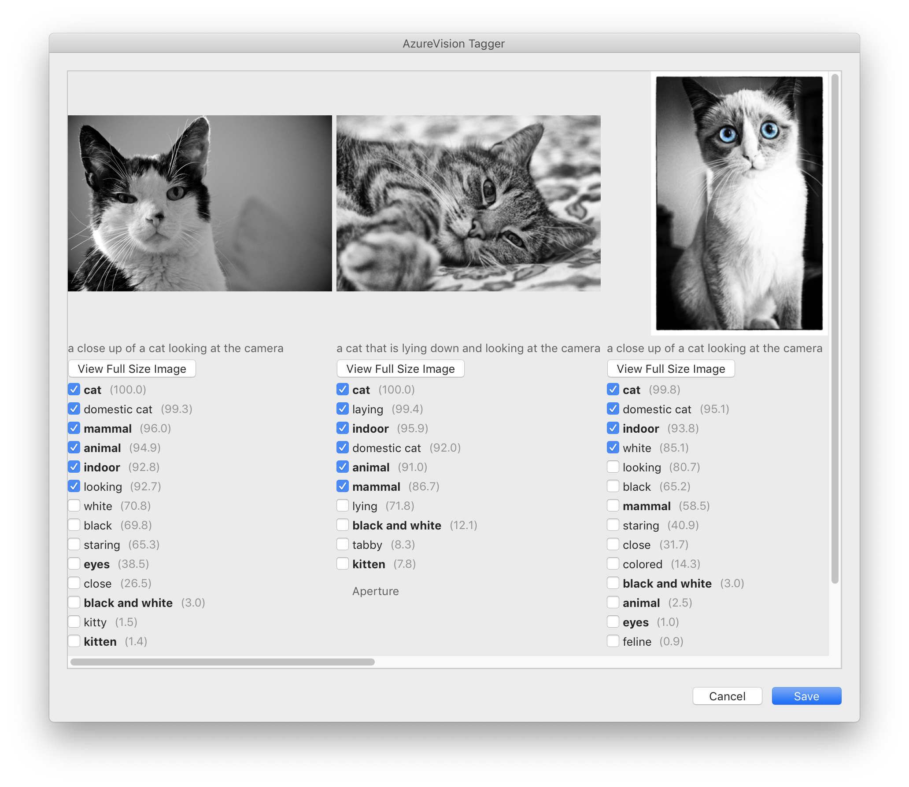
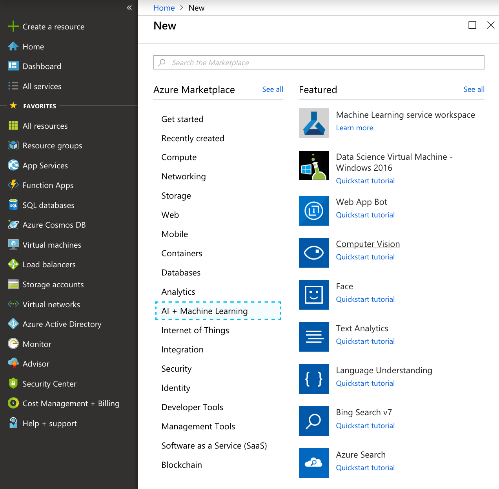
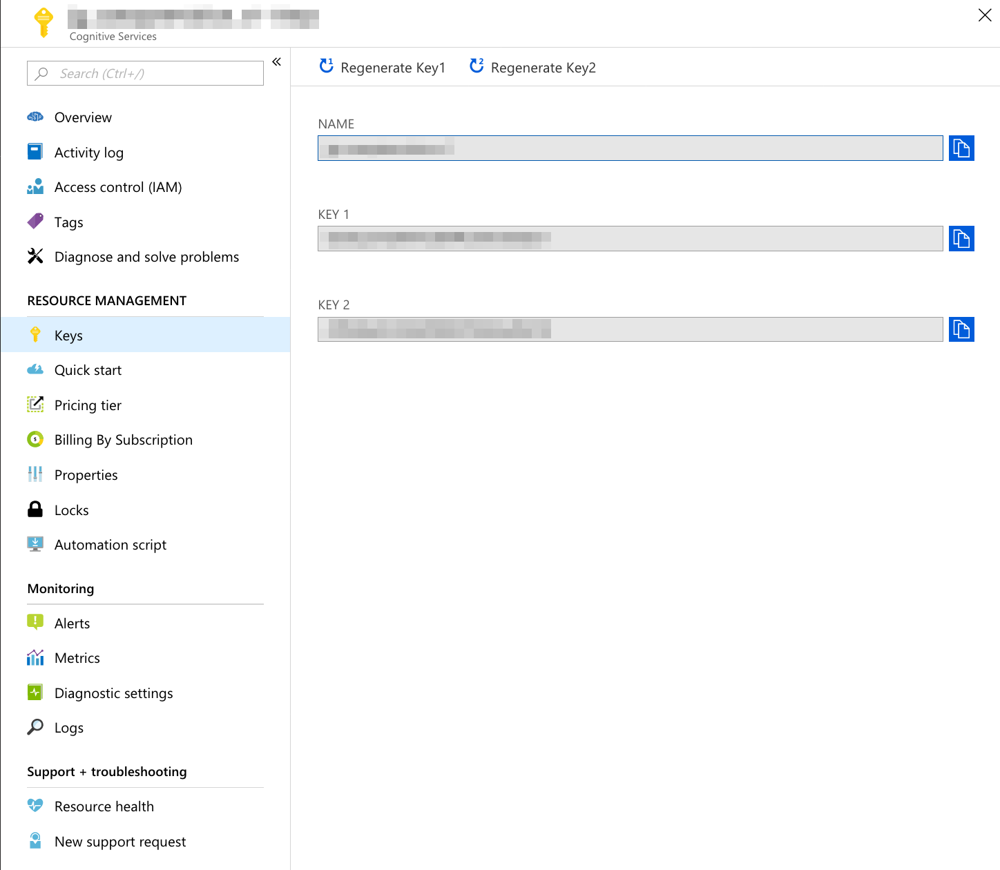
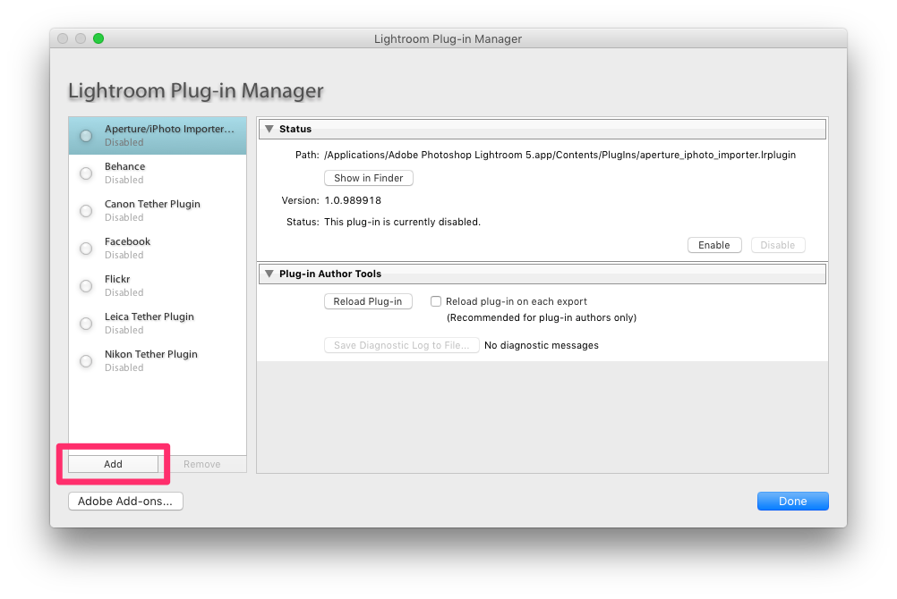
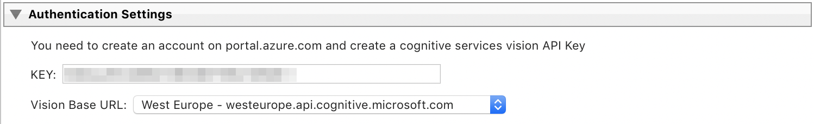
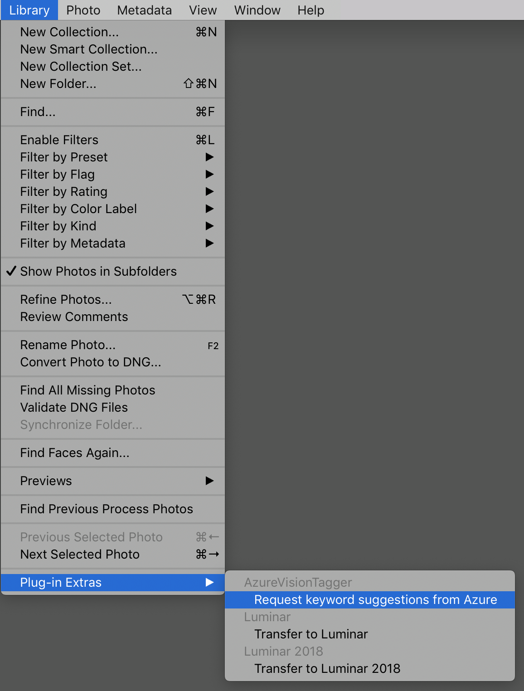
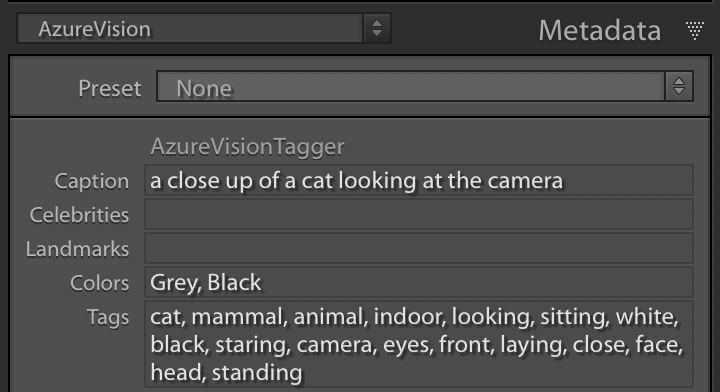

# LightroomPlugin-AzureVisionTagger

This Lightroom plugin helps you to add keywords to your photos, powered by the [Azure Vison API](https://azure.microsoft.com/id-id/services/cognitive-services/computer-vision/), visual recognition service. It is based on [safx/LightroomPlugin-ClarifaiTagger](https://github.com/safx/LightroomPlugin-ClarifaiTagger)

* works with JPEG and Raw files
* works on Windows and Mac OS X (not yet tested on Windows)

## Create a Developer Account on azure.microsoft.com

To use AzureVisionTagger, you must first create an account on [Microsoft Azure](https://azure.microsoft.com/) and create a.

1. Go to  [azure.microsoft.com](https://azure.microsoft.com/) and create an accout.

1. Log in on [portal.azure.com](https://portal.azure.com)

1. Click "Create aresource" and select "AI + Machine Learning" - "Computer Vision".

    

1. Once you create the resource, the keys are provided.

    

## Installation & Setup

To install AzureVision, follow these steps:

1. Clone or download this project.

1. Open "Lightroom Plug-in Manager" from Lightroom menu → File → Plug-in Manager...

1. Click "Add" and select the `AzureVisionTagger.lrdevplugin`.

    

    Or, simply put the `AzureVisionTagger.lrdevplugin` in its standard location as follows:

    * Mac OS X (current user only): `~/Library/Application Support/Adobe/Lightroom/Modules`
    * Mac OS X (for all users): `/Library/Application Support/Adobe/Lightroom/Modules`
    * Windows: `C:\Users\username\AppData\Roaming\Adobe\Lightroom\Modules`

1. Fill the `KEY` field with either Key1 or Key2 provided by Azure for the resource you've created. Change the `Vision-Base-URL` to the region you've created the resource in:

    

## How to use

1. Select the photos for which you want to add keywords. You may select up to 128 photos. Each selected Photo will create a single Azure Vision API Request!
1. Choose `Request keyword suggestions from Azure` from Lightroom’s `Library → Plugin-Extras` menu.

    

1. After a few seconds, the AzureVision Tagger window should pop up with the keywords suggested by Azure for each selected image.

    

1. Check keywords you want to add.
1. Click "Save" to apply changes, or "Cancel" otherwise.

## Additional Metadata
AzureVision Tagger writes additional Metadata retrived from Azure to your Catalog's Database:
    

* **Caption**: the first Caption as retrived from the [Describe Image Api](https://westus.dev.cognitive.microsoft.com/docs/services/5adf991815e1060e6355ad44/operations/56f91f2e778daf14a499e1fe)
* **Celebrities**: comma seperated list of found celebrities **NOT YET IMPLEMENTED**
* **Landmarks**: comma seperated list of found landmarks **NOT YET IMPLEMENTED**
* **Colors**: dominat colors as delovered from [Analyze Image Api](https://westus.dev.cognitive.microsoft.com/docs/services/5adf991815e1060e6355ad44/operations/56f91f2e778daf14a499e1fa)
* **Tags**: comma seperated list of tags as delivered from [Describe Image Api](https://westus.dev.cognitive.microsoft.com/docs/services/5adf991815e1060e6355ad44/operations/56f91f2e778daf14a499e1fe) *these are not identical to the keywords!*

## Preferences

### Tagging

* **Show Existing Keywords as Bold**: uses bold face for keywords which are already in the catalog's keyword list
* **Automatically Select Existing Keywords**: automatically selects the checkboxes for keywords which are already in the catalog's keyword list
* **Confidence threshold for auto-selection**:  Setting for what level of Azure-rated confidence is required for a keyword to be auto-selected. Ignored unless the "Auto-Select existing keywords" setting is selected.
* **Also automatically select new keywords**: If set, also Keywords, which are **not** already existing in the catalog's keyword list are automatically selected if above the confidence threshold. 
* **Show Confidence**: Display each keyword's rated confidence
        
* **Ignore keyword branches**: Comma-separated list of keyword terms to ignore (including chilren and descendants).

### Image Settings

* **Image Size**: sets the size of thumbnail images sent to Azure
